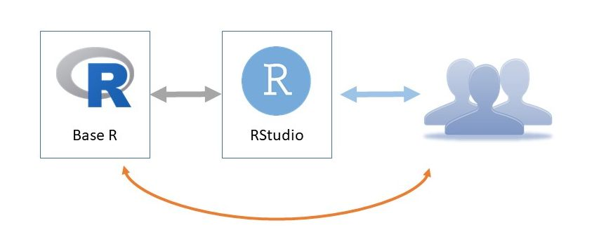
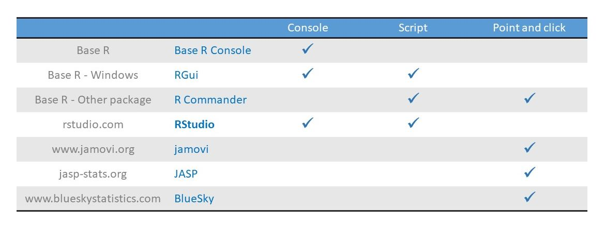
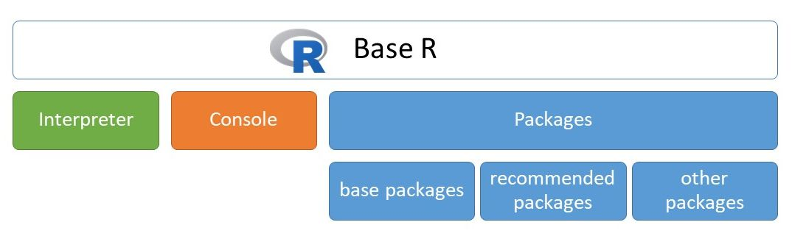
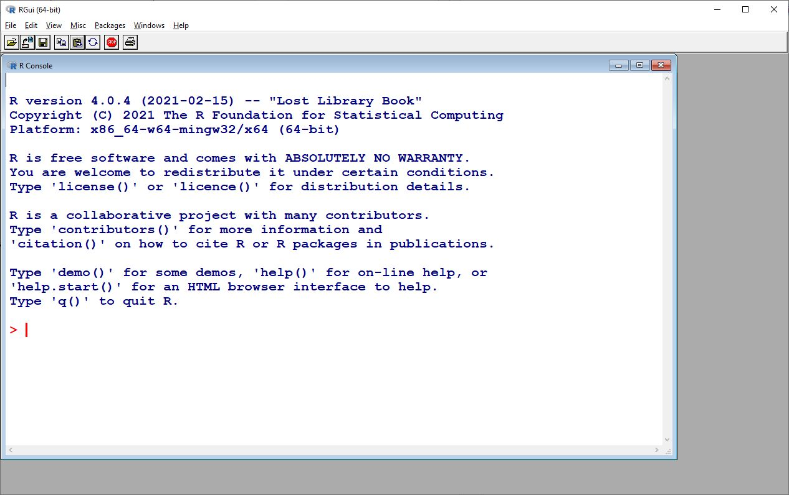
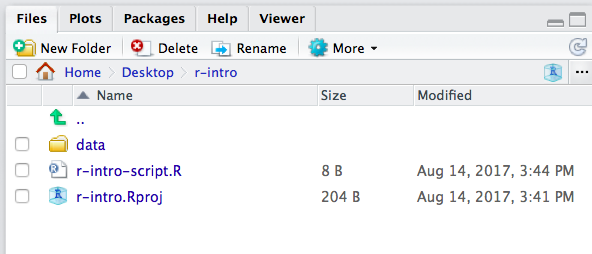

# How to use R

There are so many ways to analyse data in R. In my opinion the best way
is the RStudio. Most R users use R via *RStudio*. We need both *Base R*
and *RStudio*, as we did earlier, but if we only start the RStudio, so
we can reach all functions of R. *RStudio* is an *integrated development
environment (IDE)* that provides an interface by adding many convenient
features and tools.

<div class="figure" style="text-align: center">

<p class="caption">(\#fig:unnamed-chunk-2)How to use R – the best way</p>
</div>

Of course, we can use the *Base R* directly. Usually, this is the only
option that is supported by mainframe environment. But, if you have the
opportunity, always use *RStudio* instead of Basic R directly.

<div class="figure" style="text-align: center">

<p class="caption">(\#fig:unnamed-chunk-3)How to use R – the minimum way</p>
</div>

Actually, there are several ways to use R, not only *Base R* and
*RStudio*. The table below summarizes the interfaces in the coloumns and
the tools in the rows. There are three different types of interface:
*Console*, *Script* and *Point and clic*k. Interfaces allow the user to
interact with R. 

<div class="figure" style="text-align: center">

<p class="caption">(\#fig:unnamed-chunk-4)How to use R – the minimum way</p>
</div>

***Console*** provides a command-line *interface* that allows the user
to interact with the computer by typing commands . The computer displays
a prompt (`>`), the user types a command and presses <kbd>Enter</kbd> or
<kbd>Return</kbd>, and gets the result. There are three tools, that
provide console, the *Base R* Console (it's the only option in mainframe
environment), *RGui* in *Base R* on Windows, and *RStudio*.

The second interface is the **script interface**. It gives you an editor
window. You can type multiple lines of code into the source editor
without having each line evaluated by R. Then, when you're ready, you
can send the instructions to R - in other words, source the script -,
and you get the result. You can reach this funcionality in *RGui*, *R
Commander* and *RStudio*. **Remember, the best way to use R is creating,
editing and running scripts in *RStudio*. This is the best option.**

For begginers, the best option would be to use a **Point-and-click
interface**. It has a menu, you can choose menupoints, menuitems, you
can get dialog boxes and type in editfields, point on radio buttons and
checkboxes. **But the knowledge of these systems have limits**. You can
execute only methods, which you can reach from the menu. The descriptive
measures, tables, plots and hypothesis tests, which you can point and
click, are part of knowledge of R. The whole knowledge can be reached
only from console or script interface. For example I only use *jamovi*,
if I have a simple question and I want to get a quick answer.  So I
encourage you to install and try jamovi or JASP. These are free and user
friendly ways to do statistics. By the way, the tools I listed in this
table are all free, except the BlueSky. It is worth installing and
trying them.

## Base R

What components were installed with *Base R*? The *Base R* consists of
three elements. The console for typing commands and getting results, the
interpreter for evalueting the commands, and packages for extending R's
knowledge. The interpreter is the heart of the R, all commands will be
executed by the interpreter. For the users, for us, the console is the
key. Apart from point and click interfaces, we will interact with the
console directly or indirectly.

<div class="figure" style="text-align: center">

<p class="caption">(\#fig:unnamed-chunk-5)Components of Base R</p>
</div>

### Console of Base R

As we mentioned, the R users meet the console all the time. One main
part of *Base R* is the console. To start the console, we should type R
(the capital R letter) on all systems, or we can find and click on the R
icon. If you are on Windows, you can launch the *R.exe* (e.g.
`c:\Program Files\R\R-4.0.4\bin\x64\R.exe`).

<div class="figure" style="text-align: center">

<p class="caption">(\#fig:unnamed-chunk-6)Console in Base R</p>
</div>

On the screen above, you can see some information about the R instance.
At the bottom of the console window there is a prompt. It consits of a
'greater than' sign (symbol) and a space, and of course a cursor where
you can type any character. Let's practise together.

Let's type any character, delete characters with <kbd>Delete</kbd> and
<kbd>Backspace</kbd> keys, move the cursor with <kbd>Left arrow</kbd>
and <kbd>Right arrow</kbd> keys, insert any character in this position,
and navigate the cursor the beginning of the line and the end of the
line with the <kbd>Home</kbd> and <kbd>End</kbd> keys.

If we are ready, we can execute this line, the commad, hitting
<kbd>Enter</kbd>.

If the command is valid, R or more precisely its interpreter, will
execute it, then it returns the result in the console. If the command in
not valid, the interpreter returns an error message.

Let's start with numbers. Type 45 and hit <kbd>Enter</kbd>.


```r
45
#> [1] 45
```

This is a valid command because there is no error message. But the
result, the output, is meaningless.

Let's choose a more complicated expression:


```r
45 + 5
#> [1] 50
```

Fortyfive plus five sums fifty, so fifty is displayed in the output. The
1 in brackets at the beginning of the output means this is the first
line of the output.

#### Console features

Every console has three features, that help us to execute commands.

History of commands

:   We can use the <kbd>Up arrow</kbd> and <kbd>Down arrow</kbd> keys to
    browse the history of commands, which we typed earlier. When you
    press the <kbd>Up arrow</kbd>, you get the commands you typed
    earlier at the command line. Of course you can modify them as well.
    You can hit <kbd>Enter</kbd> at any time to run the command that is
    currently displayed.

Autocompletion

:   Pressing <kbd>TAB</kbd> key completes the keyword or directory path
    we were currently typing. Type in `getw` hit <kbd>TAB</kbd> and you
    can see the whole function call, hitting <kbd>Enter</kbd>, you can
    get the working directory.

Continue prompt

:   Lets's have a look at a small example. Tpye `45 -`(fortyfive minus)
    and hit <kbd>Enter</kbd>. This is an invalid command, but we can not
    see any Error message. Instead, a new prompt has appeared, a
    continuation prompt indicated by a `+` (plus) followed by a space
    character. We can continue typing. The console allows us to complete
    the command. It's easy, type for example `5` (five), hit
    <kbd>Enter</kbd>. We can get the result. I'll show you another
    example. Type `getwd(` without closing parenthesis, hit
    <kbd>Enter</kbd>. We will get the continuation prompt, and typing
    closing parenthesis we get the working directory. It seems to help
    us. Continuation prompt seems to be a good thing. But, It is not. It is
    a really confusing feature. We can easely find ourselves in a never
    ending story. We can type `45 -`, <kbd>Enter</kbd>, `11 *`,
    <kbd>Enter</kbd> and so on, we keep getting the continuation prompt, and
    we don't really know how to complete it in a right way. So, It is
    very important to leave the continuation prompt as soon as possible. The
    key is <kbd>Esc</kbd> button. Lets' try this. Type in opening
    parenthesis and 6 (`(6`), hit <kbd>Enter</kbd>, and press
    <kbd>Esc</kbd>. We can get back the prompt 'greater than' (`>`),
    this is defalt prompt. When you see the plus prompt, continuation
    prompt, you must press the <kbd>Esc</kbd> key.

#### Working directory

In R, we answer the questions we face using functions. So, the
expressions that we type into the command line, usually contains
*function calls*. So, now, we can request the working directroy. Let's
type `getwd()` to get the interpreter to display our working directory.


```r
getwd()
```

Working directory is the defalut directory that our command line reaches
to access files if we don't specify a path ourselves. We can specify
paths two ways either absolutely from the root directory or relatively
starting from our working directory. Beside reaching our histrory in the
command line we can also rely on the help of a built-in autocompletion
feautre, by pressing <kbd>TAB</kbd> key, which completes the keyword or
directory path we were currently typing.

For example, let's type only `set` and press <kbd>TAB</kbd> and
<kbd>TAB</kbd> again to list out all the commands that start with `set`.
Press `w` and press <kbd>TAB</kbd> again, and as you can see the command
line completes our command with a `d` to get an existing function name.
All function call requires parentheses after the function name, which
contains additional data for the function which we call arguments.

The `setwd()` function has only one required arguments, which is a path
to a directory, which we want to set as our new working directory.

Let's try calling the `setwd()` function, start with the function name,
then the opening parenthesis and inside quote marks we give the
directory's path.

On Windows, after the first quote mark, type `c:/`, which refers the
drive you want to use, and press <kbd>TAB</kbd> twice to see all
subdirectories and files on the drive.

From here we can build our path diretory by directory till we reach the
directory which we want to set as our working directory. As you can see
when jumping from directory into another we mark this jump with the
slash character. Instead of writing out the path ourselves we can write
the first few characters of directory's name and we can rely on
<kbd>TAB</kbd> to autocomplet it for us. Of course with more common
directory names we have to be more specific to get the desired
autocompletions.

Finally, if we reached our desired new working directory, we can execute
the command, by pressing enter, but make sure you have both your opening
and closing quote marks and parenthesis. If you had, your command
executed successfully thereby changing your working directory, but if
you made a mistake either in the formality of the command (called
syntactic error) or by giving a path to a directory which dosen't exsist
(called semantic error).

To sum up, to set a working directory in R type:


```r
setwd("Path/To/Your/Workingdirectory")
```

If you need to check which working directory R thinks it is in:


```r
getwd()
```

#### Quit the console

In the end, let's quit the console, by typing and executing the `q()`
command. Don't forget the parentheses. We don't need to save the
workspace. Choose `No`.

### RGui on Windows

On Windows operating system, *Base R* has another console which is more
advanced. The *RGui* has a graphical user interface. To start it, find
and clilck on the R icon. You should always use the latest version and
the 64 bit version.

<div class="figure" style="text-align: center">

<p class="caption">(\#fig:unnamed-chunk-12)Console in RGui</p>
</div>

Let's start up the afformentioned 64 bit version of it. Above you can
see our console wich in functionality is the same as the one we used in
*Base R* recently. We can type any character and press <kbd>Enter</kbd>.

If you'd like to change the apperance, or the size of the console, you
can do so in the `Edit > GUI preferences` menu in the upper menu bar.
Let's choose this menu item, and increase the font size to 28 and set
the style to bold. Close this dialog box with `OK` button, and you can
see a more readable console window. But as you can see we also have menu
and tool bar.

Let's try the same basic aritmethic command here. Type `45 + 5` and
press <kbd>Enter</kbd> to execute it. And as we can see we get the same
result here.

Let's try the history with the <kbd>Up arrow</kbd> and <kbd>Down
arrow</kbd>. Navigate the cursor with <kbd>Left arrow</kbd> and
<kbd>Right arrow</kbd> keys, use the <kbd>Home</kbd> and <kbd>End</kbd>
buttons, insert or delete any character and press <kbd>Enter</kbd>.

#### Scripting in RGui

*RGui* has all the functions the Console of *Base R* had, and also a new
one. We can create script files with which we can use to store commands
in text files. Script files makes easy to store and organize commands.
So let's click `File > New script` which will make us a new script
window where you can edit your script file.  We can arrange the Console
and Script windows, click on the `Windows > Tile horizontaly`**.** You
can find the typical face of *RGui* below.

<div class="figure" style="text-align: center">

<p class="caption">(\#fig:unnamed-chunk-13)Console in RGui</p>
</div>

Let's write the two commands in to this script file: `45 + 5` and
`getwd()`.

Here we only type out command, to actually execute them we will need to
transfer them to the console. This window is only a text editor through
which we edit our script file. Here we can only use basic notepad like
functonalities, so no autocomplition or history.

We can move in a line with the <kbd>Home</kbd> and <kbd>End</kbd>
buttons and through lines with the <kbd>Page Up</kbd> and <kbd>Page
Down</kbd> buttons. With <kbd>Ctrl+Home</kbd> we can get to the
beginning of the script file and with <kbd>Ctrl+End</kbd> we can get to
the bottom of it. Of course, this comes handy with much larger script
files.

We can mark parts of the text with either holding the <kbd>Shift</kbd>
key and using the <kbd>Left-Right-Up-Down arrow</kbd> keys or using the
mouse. And we can use the clipboard as well, <kbd>Ctrl+C</kbd>,
<kbd>Ctrl+X</kbd> and <kbd>Ctrl+V</kbd>.

It's important to know how to actually execute the commands we just
wrote into our script file. With <kbd>Ctrl+R</kbd> we can execute the
line that our cursor is currently at. The process consists of the
command getting pulled into the console and then it executing it.

Let's try it together. Move the cursor into the first line. Click in the
first line anywhere. Then press the <kbd>Ctrl+R</kbd>. Three things
happened at he same time. The first line was pulled into the console,
the line was executed, and the cursor jumped down a line. We can repress
the <kbd>Ctrl+R</kbd> and repeat the whole process for the second line.
And so on.

If you have any text selected in your editor prior, pressing
<kbd>Ctrl+R</kbd>, then the selected text will be executed. Let's also
try this. Select only `5 + 5` from the first line, and press
<kbd>Ctrl+R</kbd>, and you get 10. Then, select the first two lines and
execute them with <kbd>Ctrl+R</kbd>. The interpreter ran both lines. You
can see the result in the console.

As you might have noticed, we have a colored console, the inputs, the
commands colored by red, and the outputs, the results colored by blue.

This script files can also contain comments, which is usefull to mark
what's the command's intention. Which ones again may seem unimportant
now, but is really usefull when working with massive script files.

To mark something as a comment use the hash mark (`#`) which marks
everything in a line after the hash mark as a comment. It's good
practice to start your script file with 3 comment lines which containes
the author of the file, the date and a name which gives some kind of
information about what the script does. 


```r
# Kálmán Abari
# 2021-03-17
# First script file
```

Let's try it together. Navigate the cursor to the first position of the
file, for example pressing the <kbd>Ctrl+Home</kbd>. Then type a hash
mark, and your name, <kbd>Enter</kbd>. Hash mark, date of today,
<kbd>Enter</kbd>, hash mark `First script file`, <kbd>Enter</kbd>.

If we are ready, we are going to save the script file. It's important to
save the script file with the file menu's save option. It's good
practice to save your work every 15 minutes. It's important that when we
save our files we give them names that doesn't contain any special
characters or whitespaces, underscores are accpetable though. Choose a
proper directroy and type in `first_script.R` as the filename. Make sure
that our file's extension should be `.R` which means that it contains an
R script file.

With that we covered the basics of the *RGui*, so we can close it for
now, we shouldn't worry about saving our workspace since we won't be
needing it.

## RStudio

The last tool we will get to know now and will be using for the rest of
the book is *RStudio*. We can also launch it from the start menu. While
we had multiple *Basic R* instances, we only have one *RStudio*, so it
should be easy to find it.

It's the most advanced interface to use R from the afformentioned ones.
And this will be the one that we will mainly use through out the course.
Even though we will only use RStudio, it's important to mention that
RStudio relies on Base R to work.

We can easily check which instance of Base R our Rstudio is using. We
can see this in the **Global options** menu under the **Tools** menu bar
option.

Let's check if it really is using the 64 (sixtyfour) bit version.

Here we can also do other customizations. While we're here we should
also uncheck the **Restore .Rdata option** and set the **Save workspace
to Rdata on exit option** to never.

Another important one is the **Code** menu point from the left list.
Here under the **Saving option** we have to set the **default text
encoding** to UTF-8 which is a wildily used and accepted character-code
standard.

You can customize to look of your editor under the Apperance option.
Here you can change the theme of your editor, which is sets the color
palette it uses. I recommend changing it to **Tomorrow night bright**.
Let's close the settings, by pressing OK, to save the changes we made.

A few words about RStudio. The main area consists of 3 or 4 different
panes or windows which all are responsible for a different task. You
have 3 panes by basic. The fourth panes you can add is a script file
editor, the source pane.

Which you can do by creating a new script file in **file** -- **new
file** -- RScript.

You can easily resize the panes with clicking and dragging the vertical
or horizontal line between the panes.

A left top, you find your script file editor. At left bottom there's
your console. At the right top is your enviroment. Which containes
objects we created and their properties. For now it should be empty.
Let's also watch out for the fact that these panes have multiple tabs on
them. This panes also contains the history tab which is another way for
us to access our command history.

The right bottom pane's **Files** tab lists our working directory and
its content. The **plots** tab houses user created diagrams.

Today we'll set our focus on the panes on the left.

Let's put a basic addition, subtraction, multiplication, divison and an
extra expression, an exponentiation [eksponesiéisön] (exponent), into
our editor on the top left.  We use plus, minus, asterisk, slah and
double asterisks or hat symbols. So basically double asterisk \*\*
behaves exactly like \^ (hat, caret), these are **to-the-power-of** ,
exponent operators.

45 + 5 enter

45 -- 5 enter

 

We can use decimals, for example zero point five, zero point three
three.

45 \* 0.5 (fortyfive multiplied by zero point five)

45 / 0.33  (fortyfive devided by zero point five)

We need to use the whole number, decimal point and decimal places
(tenth, one-tenth, one hundredth, one thousends).

45 \*\* 3 forty five cubed, forty five to the power of 3

45 \^ 3 forty five cubed again, using hat symbol (usually we type Alt Gr
+ 3 keys than a space. It is not easy to write out, so we can use the
double asterik.)

 

Let's set the cursor on the first line a press **Ctrl+Enter** and see
what happens. As in Rgui with **Ctrl+R**, here in RStudio we use
**Ctrl+Enter** to execute the line our cursor's at. It does the same
thing, copying our command to the console and executing it too. Pressing
a new **Ctrl+Enter**  run all lines.

**What makes RStudio more appealing?** First, our lines are numbered
which makes navigation and future bug fixing more easier. Our code is
more easily readable because keywords with different functionality get
coloured with different colors.

Here we can use autocomplition even in the script editor. Typing
**getw** you can choose the proper function, for example the **getwd()**
function. Press Ctrl+Enter to get the working directory.

When we work with longer script files, we can make bookmarks, which
provide easy navigation to specific parts of our code. We can do so, by
ending a comment line with 4 dashes.

You can access these bookmarks and jump to the part of the code they
mark by clicking **this button on the rigth of the source pane**, in the
top right corner of your script editor.

In R we can reference numbers by the base 10 system, the hexadecimal
variation of it. We can use integers, decimals. And we can give numbers
in exponential form which is a scientific notation, where the number
after 'e' gives the powers of ten.

 

 

 

 

 

 

 

 

 

 

 

 

 

 

 

 

 

 

 

 

However as of now, the most current version of R is 4.0.4. And so I
encourage you to install that version of R, which should be the default
version that you find when you go to the R website. So I, in general,  I
always encourage people to use the latest version of software because
those will have the latest features and they will have hopefully fixed
bugs that may have been present in earlier version.

You won't need them.

 

> Learning Objectives
>
> -   Be familiar with reasons to use R.
> -   Understand how R relates to RStudio.
> -   Be able to navigate the RStudio interface including the Script,
>     Console, Environment, Help, Files, and Plots windows.
> -   Create an R Project in RStudio.
> -   Set a "working" directory.
> -   Send commands from the Script window to the Console in RStudio.

------------------------------------------------------------------------

## What is R? What is RStudio?

The term "R" is used to refer to both the programming language to write
scripts and the software ("environment") that interprets the scripts
written in R. It is an alternative to statistical packages like SAS,
SPSS, or Stata, which lets you perform a wide variety of data analysis,
statistics, and visualization.

RStudio is currently a very popular way to not only write your R scripts
but also to interact with the R software. To function correctly, RStudio
needs R and therefore both need to be installed on your computer.

## Why learn R?

### R does not involve lots of pointing and clicking, and that's a good thing

The learning curve might be steeper than with other software, but with
R, the results of your analysis does not rely on remembering a
succession of pointing and clicking, but instead on a series of written
commands, and that's a good thing! So, if you want to redo your analysis
because you collected more data, you don't have to remember which button
you clicked in which order to obtain your results, you just have to run
your script again.

Working with scripts makes the steps you used in your analysis clear,
and the code you write can be inspected by someone else who can give you
feedback and spot mistakes.

Working with scripts forces you to have a deeper understanding of what
you are doing, and facilitates your learning and comprehension of the
methods you use.

### R code is great for reproducibility

Reproducibility is when someone else (including your future self) can
obtain the same results from the same dataset when using the same
analysis.

R integrates with other tools to generate manuscripts from your code. If
you collect more data, or fix a mistake in your dataset, the figures and
the statistical tests in your manuscript are updated automatically.

An increasing number of journals and funding agencies expect analyses to
be reproducible, so knowing R will give you an edge with these
requirements.

### R is interdisciplinary and extensible

With 10,000+ packages that can be installed to extend its capabilities,
R provides a framework that allows you to combine statistical approaches
from many scientific disciplines to best suit the analytical framework
you need to analyze your data. For instance, R has packages for image
analysis, mapping, time series, text mining, and a lot more.

### R works on data of all shapes and sizes

The skills you learn with R scale easily with the size of your dataset.
Whether your dataset has hundreds or millions of lines, it won't make
much difference to you.

R is designed for data analysis. It comes with special data structures
and data types that make handling of missing data and statistical
factors convenient.

R can connect to spreadsheets, databases, and many other data formats,
on your computer or on the web.

### R produces high-quality graphics

The plotting functionalities in R are endless, and allow you to adjust
any aspect of your graph to convey most effectively the message from
your data.

### R has a large community

Thousands of people use R daily. Many of them are willing to help you
through mailing lists and websites such as [Stack
Overflow](https://stackoverflow.com/questions/tagged/r).

### Not only is R free, but it is also open-source and cross-platform

Anyone can inspect the source code to see how R works. Because of this
transparency, there is less chance for mistakes, and if you (or someone
else) find some, you can report and fix bugs.

## Knowing your way around RStudio

Let's start by learning about [RStudio](https://www.rstudio.com/), which
is an Integrated Development Environment (IDE) for working with R.

The RStudio IDE open-source product is free under the [Affero General
Public License (AGPL)
v3](https://www.gnu.org/licenses/agpl-3.0.en.html). The RStudio IDE is
also available with a commercial license and priority email support from
RStudio, Inc.

We will use RStudio IDE to write code, navigate the files on our
computer, inspect the variables we are going to create, and visualize
the plots we will generate. RStudio can also be used for other things
(e.g., version control, developing packages, writing Shiny apps) that we
will not cover during the workshop.

<div class="figure">

<p class="caption">(\#fig:RStudio-GUI)The RStudio Interface</p>
</div>

RStudio is divided into 4 "Panes":

-   the **Source** for your scripts and documents (top-left, in the
    default layout),
-   the R **Console** (bottom-left),
-   your **Environment/History** (top-right), and
-   your **Files/Plots/Packages/Help/Viewer** (bottom-right).

The placement of these panes and their content can be customized (see
main Menu, Tools -\> Global Options -\> Pane Layout). One of the
advantages of using RStudio is that all the information you need to
write code is available in a single window.

## How to start an R project


It is good practice to keep a set of related data, analyses, and text
self-contained in a single folder. When working with R and RStudio you
typically want that single top folder to be the folder you are working
in. In order to tell R this, you will want to set that folder as your
**working directory**. Whenever you refer to other scripts or data or
directories contained within the working directory you can then use
*relative paths* to files that indicate where inside the project a file
is located. (That is opposed to absolute paths, which point to where a
file is on a specific computer). Having everything contained in a single
directory makes it a lot easier to move your project around on your
computer and share it with others without worrying about whether or not
the underlying scripts will still work.

Whenever you create a project with RStudio it creates a working
directory for you and remembers its location (allowing you to quickly
navigate to it) and optionally preserves custom settings and open files
to make it easier to resume work after a break. Below, we will go
through the steps for creating an "R Project" for this workshop.

-   Start RStudio
-   Under the `File` menu, click on `New project`, choose
    `New directory`, then `Empty project`
-   As directory (or folder) name enter `r-intro` and create project as
    subdirecory of your desktop folder: `~/Desktop`
-   Click on `Create project`
-   Under the `Files` tab on the right of the screen, click on
    `New Folder` and create a folder named `data` within your newly
    created working directory (e.g., `~/r-intro/data`)
-   On the main menu go to `Files` \> `New File` \> `R Script` (or use
    the shortcut <kbd>`Shift`</kbd> + <kbd>`Cmd`</kbd> + <kbd>`N`</kbd>)
    to open a new file
-   Save the empty script as `r-intro-script.R` in your working
    directory.

Your working directory should now look like in Figure
\@ref(fig:working-dir).

<div class="figure">

<p class="caption">(\#fig:working-dir)What it should look like at the beginning of this lesson</p>
</div>

If you ever need to set a different working directory you can use the
RStudio interface like seen in Figure \@ref(fig:set-working-dir).

<div class="figure">

<p class="caption">(\#fig:set-working-dir)How to set a working directory with the RStudio interface</p>
</div>

Alternatively, you can use the shortcut <kbd>Ctrl + Shift + H</kbd> to
set a working directory in RStudio.

### Organizing your working directory

Using a consistent folder structure across your projects will help keep
things organized, and will also make it easy to find/file things in the
future. This can be especially helpful when you have multiple projects.
In general, you may create directories (folders) for **scripts**,
**data**, and **documents**.

-   **`data/`** Use this folder to store your raw data and intermediate
    datasets you may create for the need of a particular analysis. For
    the sake of transparency and
    [provenance](https://en.wikipedia.org/wiki/Provenance), you should
    *always* keep a copy of your raw data accessible and do as much of
    your data cleanup and preprocessing programmatically (i.e., with
    scripts, rather than manually) as possible. Separating raw data from
    processed data is also a good idea. For example, you could have
    subfolders in your `data` directory named `data/raw/` and
    `data/processed` that woudl contain the respective raw and processed
    files. I also like to log my data processing steps in a simple
    textfile that I keep there as well.
-   **`documents/`** If you are wroking on a paper this would be a place
    to keep outlines, drafts, and other text.
-   **`scripts/`** This would be the location to keep your R scripts.
    Again, depending on the complexity, you may want to add subfolders
    that contain, for example all the plotting scripts, or all the datas
    cleaning scripts.

You may want additional directories or subdirectories depending on your
project needs, but this is a good template to form the backbone of your
working directory.

## Interacting with R

The basis of programming is that we write down instructions for the
computer to follow, and then we tell the computer to follow those
instructions. We write, or *code*, instructions in R because it is a
common language that both the computer and we can understand. We call
the instructions *commands* and we tell the computer to follow the
instructions by *executing* (also called *running*) those commands.

There are two main ways of interacting with R: by using the **console**
or by using **script files** (plain text files that contain your code).

### RStudio Console and Command Prompt

The console pane in RStudio is the place where commands written in the R
language can be typed and executed immediately by the computer. It is
also where the results will be shown for commands that have been
executed. You can type commands directly into the console and press
<kbd>Enter</kbd> to execute those commands, but they will be forgotten
when you close the session.

If R is ready to accept commands, the R console by default shows a `>`
prompt. If it receives a command (by typing, copy-pasting or sent from
the script editor using <kbd>Ctrl Enter</kbd>), R will try to execute
it, and when ready, will show the results and come back with a new `>`
prompt to wait for new commands.

If R is still waiting for you to enter more data because it isn't
complete yet, the console will show a `+` prompt. It means that you
haven't finished entering a complete command. This is because you have
not 'closed' a parenthesis or quotation, i.e. you don't have the same
number of left-parentheses as right-parentheses, or the same number of
opening and closing quotation marks. When this happens, and you thought
you finished typing your command, click inside the console window and
press <kbd>Esc</kbd>; this will cancel the incomplete command and return
you to the `>` prompt.

sfsdfsfsfsf

:   rwrwrwrwr

werwerwer

:   werwerwrwerwer

## Quarterly Results {.tabset}

### By Product

1212121212121

### By Region

56565656565

> <h3>
>
> Challenge
>
> </h3>
>
> -   Use R to determine what your working directory is.
> -   Use R to change your working directory to some other place. What
>     do you notice in the RStudio Files window?
> -   Use RStudio to change back to your previous working directory
>     (r-intro) What do you notice in the RStudio Console?

### RStudio Script Editor

Because we want to keep our code and workflow, it is better to type the
commands we want in the script editor, and save the script. This way,
there is a complete record of what we did, and anyone (including our
future selves!) can easily replicate the results on their computer.

Perhaps one of the most important aspects of making your code
comprehensible for others and your future self is adding comments about
why you did something. You can write comments directly in your script,
and tell R not no execute those words simply by putting a hashtag (`#`)
before you start typing the comment.


```r
# this is a comment on its on line
getwd() # comments can also go here
```

One of the first things you will notice is in the R script editor that
your code is colored (syntax coloring) which enhances readibility.

Secondly, RStudio allows you to execute commands directly from the
script editor by using the <kbd>Ctrl + Enter</kbd> shortcut (on Macs,
<kbd>Cmd + Enter</kbd> will work, too). The command on the current line
in the script (indicated by the cursor) or all of the commands in the
currently selected text will be sent to the console and executed when
you press <kbd>Ctrl + Enter</kbd>. You can find other keyboard shortcuts
under `Tools` \> `Keyboard Shortcuts Help` (or <kbd>`Alt`</kbd> +
<kbd>`Shift`</kbd> + <kbd>`K`</kbd>)

At some point in your analysis you may want to check the content of a
variable or the structure of an object, without necessarily keeping a
record of it in your script. You can type these commands and execute
them directly in the console. RStudio provides the <kbd>Ctrl + 1</kbd>
and <kbd>`Ctrl`</kbd> + <kbd>`2`</kbd> shortcuts allow you to jump
between the script and the console panes.

In addition to shortcuts RStudio also provides autocompletion. If you
begin typing a command or the name of a variable or (under certain
conditions) even filenames you have on your latop and thenb hit the
<kbd>`Tab`</kbd> key, it will make suggestions and relieve you from
typing. More on code completion in RStudio is here:
<https://support.rstudio.com/hc/en-us/articles/205273297-Code-Completion>

All in all, RStudio is designed to make your coding easier and less
error-prone.
