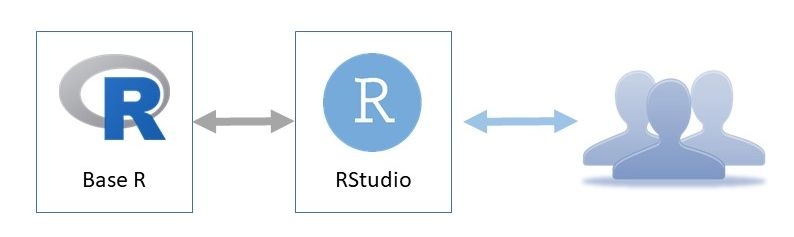
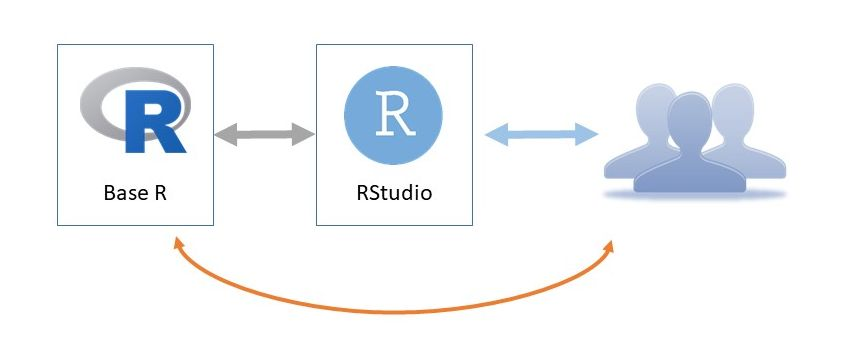
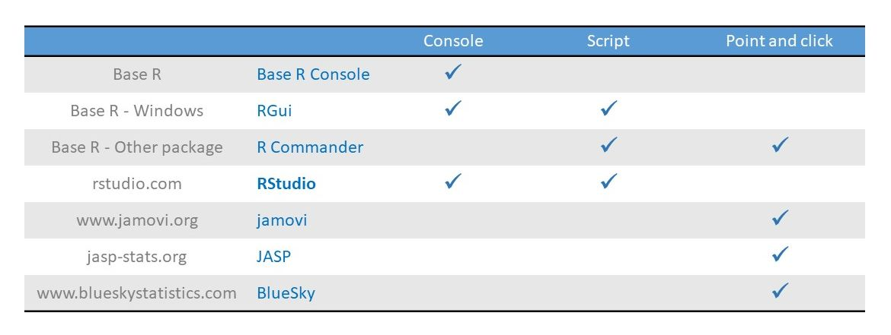
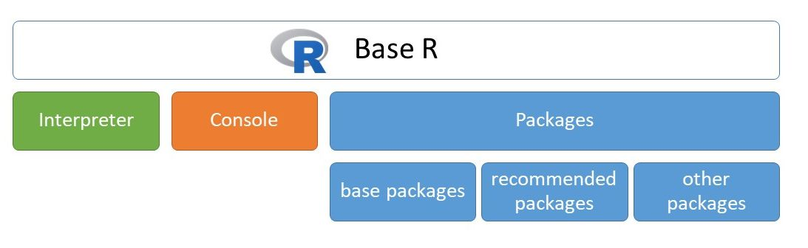
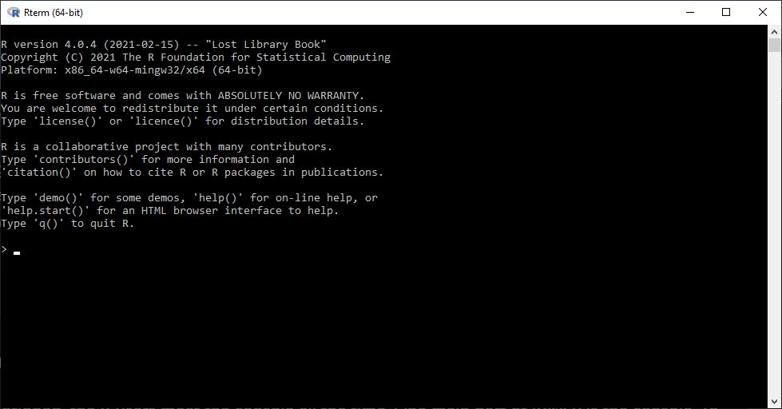
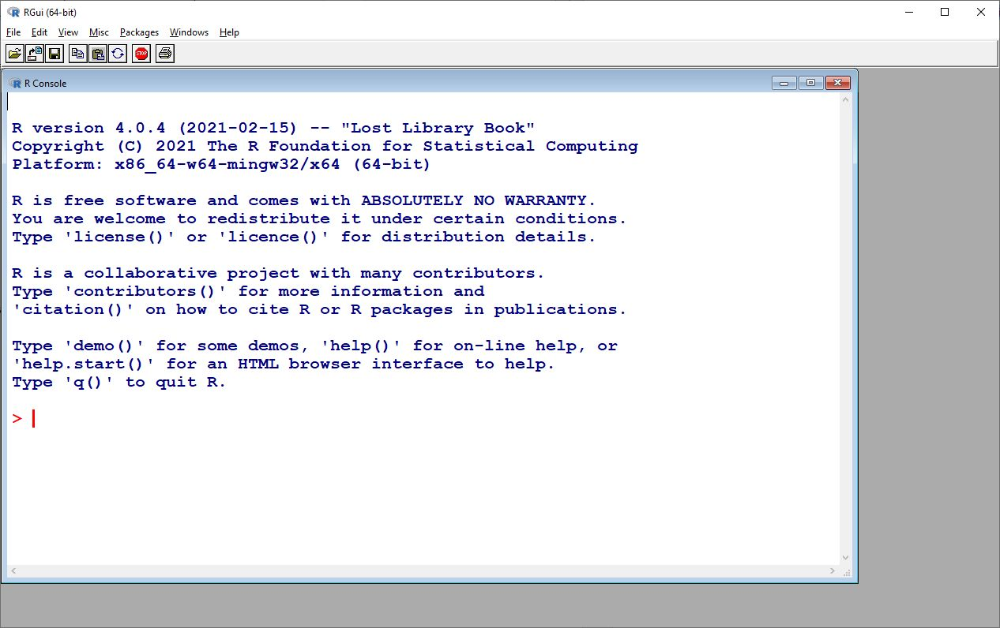
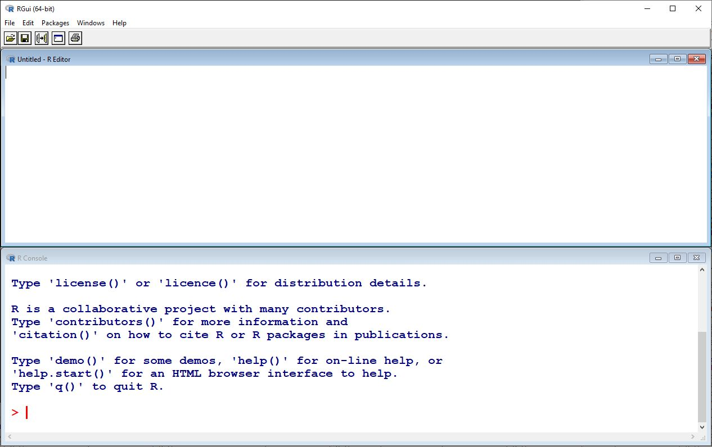
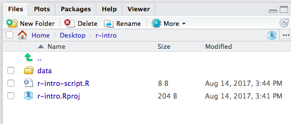

# How to use R

There are so many ways to analyse data in R. In my opinion the best way
is the RStudio. Most R users use R via *RStudio*. We need both *Base R*
and *RStudio*, as we did earlier, but if we only start the RStudio, so
we can reach all functions of R. *RStudio* is an *integrated development
environment (IDE)* that provides an interface by adding many convenient
features and tools.

<div class="figure" style="text-align: center">

<p class="caption">(\#fig:unnamed-chunk-2)How to use R – the best way</p>
</div>

Of course, we can use the *Base R* directly. Usually, this is the only
option that is supported by mainframe environment. But, if you have the
opportunity, always use *RStudio* instead of Basic R directly.

<div class="figure" style="text-align: center">

<p class="caption">(\#fig:unnamed-chunk-3)How to use R – the minimum way</p>
</div>

Actually, there are several ways to use R, not only *Base R* and
*RStudio*. The table below summarizes the interfaces in the columns and
the tools in the rows. There are three different types of interface:
*Console*, *Script* and *Point and clic*k. Interfaces allow the user to
interact with R. 

<div class="figure" style="text-align: center">

<p class="caption">(\#fig:unnamed-chunk-4)How to use R – the minimum way</p>
</div>

***Console*** provides a command-line *interface* that allows the user
to interact with the computer by typing commands . The computer displays
a prompt (`>`), the user types a command and presses <kbd>Enter</kbd> or
<kbd>Return</kbd>, and gets the result. There are three tools, that
provide console, the *Base R* Console (it's the only option in mainframe
environment), *RGui* in *Base R* on Windows, and *RStudio*.

The second interface is the **script interface**. It gives you an editor
window. You can type multiple lines of code into the source editor
without having each line evaluated by R. Then, when you're ready, you
can send the instructions to R - in other words, source the script -,
and you get the result. You can reach this functionality in *RGui*, *R
Commander* and *RStudio*. **Remember, the best way to use R is creating,
editing and running scripts in *RStudio*. This is the best option.**

For beginners, the best option would be to use a **Point-and-click
interface**. It has a menu, you can choose menupoints, menuitems, you
can get dialog boxes and type in editfields, point on radio buttons and
checkboxes. **But the knowledge of these systems have limits**. You can
execute only methods, which you can reach from the menu. The descriptive
measures, tables, plots and hypothesis tests, which you can point and
click, are part of knowledge of R. The whole knowledge can be reached
only from console or script interface. For example I only use *jamovi*,
if I have a simple question and I want to get a quick answer.  So I
encourage you to install and try jamovi or JASP. These are free and user
friendly ways to do statistics. By the way, the tools I listed in this
table are all free, except the BlueSky. It is worth installing and
trying them.

## Base R

What components were installed with *Base R*? The *Base R* consists of
three elements. The console for typing commands and getting results, the
interpreter for evaluating the commands, and packages for extending R's
knowledge. The interpreter is the heart of the R, all commands will be
executed by the interpreter. For the users, for us, the console is the
key. Apart from point and click interfaces, we will interact with the
console directly or indirectly.

<div class="figure" style="text-align: center">

<p class="caption">(\#fig:unnamed-chunk-5)Components of Base R</p>
</div>

### Console of Base R

As we mentioned, the R users meet the console all the time. One main
part of *Base R* is the console. To start the console, we should type R
(the capital R letter) on all systems, or we can find and click on the R
icon. If you are on Windows, you can launch the *R.exe* (e.g.
`c:\Program Files\R\R-4.0.4\bin\x64\R.exe`).

<div class="figure" style="text-align: center">

<p class="caption">(\#fig:unnamed-chunk-6)Console in Base R</p>
</div>

On the screen above, you can see some information about the R instance.
At the bottom of the console window there is a prompt. It consists of a
'greater than' sign (symbol) and a space, and of course a cursor where
you can type any character.

Let's type any character, delete characters with <kbd>Delete</kbd> and
<kbd>Backspace</kbd> keys, move the cursor with <kbd>Left arrow</kbd>
and <kbd>Right arrow</kbd> keys, insert any character in this position,
and navigate the cursor the beginning of the line and the end of the
line with the <kbd>Home</kbd> and <kbd>End</kbd> keys.

If we are ready, we can execute this line, the command, hitting
<kbd>Enter</kbd>.

If the command is valid, R or more precisely its interpreter, will
execute it, then it returns the result in the console. If the command in
not valid, the interpreter returns an error message.

Let's start with numbers. Type 45 and hit <kbd>Enter</kbd>.


```r
45
#> [1] 45
```

This is a valid command because there is no error message. But the
result, the output, is meaningless.

Let's choose a more complicated expression:


```r
45 + 5
#> [1] 50
```

Forty-five plus five sums fifty, so fifty is displayed in the output.
The 1 in brackets at the beginning of the output means this is the first
line of the output.

#### Console features

Every console has three features, that help us to execute commands.

History of commands

:   We can use the <kbd>Up arrow</kbd> and <kbd>Down arrow</kbd> keys to
    browse the history of commands, which we typed earlier. When you
    press the <kbd>Up arrow</kbd>, you get the commands you typed
    earlier at the command line. Of course you can modify them as well.
    You can hit <kbd>Enter</kbd> at any time to run the command that is
    currently displayed.

Autocompletion

:   Pressing <kbd>TAB</kbd> key completes the keyword or directory path
    we were currently typing. Type in `getw` hit <kbd>TAB</kbd> and you
    can see the whole function call, hitting <kbd>Enter</kbd>, you can
    get the working directory.

Continuation prompt

:   Let's have a look at a small example. Tpye `45 -`(forty-five minus)
    and hit <kbd>Enter</kbd>. This is an invalid command, but we can not
    see any Error message. Instead, a new prompt has appeared, a
    continuation prompt indicated by a `+` (plus) followed by a space
    character. We can continue typing. The console allows us to complete
    the command. It's easy, type for example `5` (five), hit
    <kbd>Enter</kbd>. We can get the result. I'll show you another
    example. Type `getwd(` without closing parenthesis, hit
    <kbd>Enter</kbd>. We will get the continuation prompt, and typing
    closing parenthesis we get the working directory. It seems to help
    us. Continuation prompt seems to be a good thing. But, It is not. It
    is a really confusing feature. We can easily find ourselves in a
    never ending story. We can type `45 -`, <kbd>Enter</kbd>, `11 *`,
    <kbd>Enter</kbd> and so on, we keep getting the continuation prompt,
    and we don't really know how to complete it in a right way. So, It
    is very important to leave the continuation prompt as soon as
    possible. The key is <kbd>Esc</kbd> button. Lets' try this. Type in
    opening parenthesis and 6 (`(6`), hit <kbd>Enter</kbd>, and press
    <kbd>Esc</kbd>. We can get back the prompt 'greater than' (`>`),
    this is default prompt. When you see the plus prompt, continuation
    prompt, you must press the <kbd>Esc</kbd> key.

#### Working directory

In R, we answer the questions we face using functions. So, the
expressions that we type into the command line, usually contains
*function calls*. So, now, we can request the working directory. Let's
type `getwd()` to get the interpreter to display our working directory.


```r
getwd()
```

Working directory is the default directory that our command line reaches
to access files if we don't specify a path ourselves. We can specify
paths two ways either absolutely from the root directory or relatively
starting from our working directory. Beside reaching our history in the
command line we can also rely on the help of a built-in autocompletion
feature, by pressing <kbd>TAB</kbd> key, which completes the keyword or
directory path we were currently typing.

For example, let's type only `set` and press <kbd>TAB</kbd> and
<kbd>TAB</kbd> again to list out all the commands that start with `set`.
Press `w` and press <kbd>TAB</kbd> again, and as you can see the command
line completes our command with a `d` to get an existing function name.
All function call requires parentheses after the function name, which
contains additional data for the function which we call arguments.

The `setwd()` function has only one required arguments, which is a path
to a directory, which we want to set as our new working directory.

Let's try calling the `setwd()` function, start with the function name,
then the opening parenthesis and inside quote marks we give the
directory's path.

On Windows, after the first quote mark, type `c:/`, which refers the
drive you want to use, and press <kbd>TAB</kbd> twice to see all
subdirectories and files on the drive.

From here we can build our path directory by directory till we reach the
directory which we want to set as our working directory. As you can see
when jumping from directory into another we mark this jump with the
slash character. Instead of writing out the path ourselves we can write
the first few characters of directory's name and we can rely on
<kbd>TAB</kbd> to autocomplet it for us. Of course with more common
directory names we have to be more specific to get the desired
autocompletions.

Finally, if we reached our desired new working directory, we can execute
the command, by pressing enter, but make sure you have both your opening
and closing quote marks and parenthesis. If you had, your command
executed successfully thereby changing your working directory, but if
you made a mistake either in the formality of the command (called
syntactic error) or by giving a path to a directory which doesn't exist
(called semantic error).

To sum up, to set a working directory in R type:


```r
setwd("Path/To/Your/Workingdirectory")
```

If you need to check which working directory R thinks it is in:


```r
getwd()
```

#### Quit the console

In the end, let's quit the console, by typing and executing the `q()`
command. Don't forget the parentheses. We don't need to save the
workspace. Choose `No`.

### RGui on Windows

On Windows operating system, *Base R* has another console which is more
advanced. The *RGui* has a graphical user interface. To start it, find
and click on the R icon. You should always use the latest version and
the 64 bit version.

<div class="figure" style="text-align: center">

<p class="caption">(\#fig:unnamed-chunk-12)Console in RGui</p>
</div>

Let's start up the aforementioned 64 bit version of it. Above you can
see our console which in functionality is the same as the one we used in
*Base R* recently. We can type any character and press <kbd>Enter</kbd>.

If you'd like to change the appearance, or the size of the console, you
can do so in the `Edit > GUI preferences` menu in the upper menu bar.
Let's choose this menu item, and increase the font size to 28 and set
the style to bold. Close this dialog box with `OK` button, and you can
see a more readable console window. But as you can see we also have menu
and tool bar.

Let's try the same basic arithmetic command here. Type `45 + 5` and
press <kbd>Enter</kbd> to execute it. And as we can see we get the same
result here.

Let's try the history with the <kbd>Up arrow</kbd> and <kbd>Down
arrow</kbd>. Navigate the cursor with <kbd>Left arrow</kbd> and
<kbd>Right arrow</kbd> keys, use the <kbd>Home</kbd> and <kbd>End</kbd>
buttons, insert or delete any character and press <kbd>Enter</kbd>.

#### Scripting in RGui

*RGui* has all the functions the Console of *Base R* had, and also a new
one. We can create script files with which we can use to store commands
in text files. Script files makes easy to store and organize commands.
So let's click `File > New script` which will make us a new script
window where you can edit your script file. We can arrange the Console
and Script windows, click on the `Windows > Tile horizontally`**.** You
can find the typical face of *RGui* below.

<div class="figure" style="text-align: center">

<p class="caption">(\#fig:unnamed-chunk-13)Console in RGui</p>
</div>

Let's write the two commands in to this script file: `45 + 5` and
`getwd()`.

Here we only type out command, to actually execute them we will need to
transfer them to the console. This window is only a text editor through
which we edit our script file. Here we can only use basic notepad like
functionalities, so no autocompletion or history.

We can move in a line with the <kbd>Home</kbd> and <kbd>End</kbd>
buttons and through lines with the <kbd>Page Up</kbd> and <kbd>Page
Down</kbd> buttons. With <kbd>Ctrl+Home</kbd> we can get to the
beginning of the script file and with <kbd>Ctrl+End</kbd> we can get to
the bottom of it. Of course, this comes handy with much larger script
files.

We can mark parts of the text with either holding the <kbd>Shift</kbd>
key and using the <kbd>Left-Right-Up-Down arrow</kbd> keys or using the
mouse. And we can use the clipboard as well, <kbd>Ctrl+C</kbd>,
<kbd>Ctrl+X</kbd> and <kbd>Ctrl+V</kbd>.

It's important to know how to actually execute the commands we just
wrote into our script file. With <kbd>Ctrl+R</kbd> we can execute the
line that our cursor is currently at. The process consists of the
command getting pulled into the console and then it executing it.

Let's try it. Move the cursor into the first line. Click in the first
line anywhere. Then press the <kbd>Ctrl+R</kbd>. Three things happened
at he same time. The first line was pulled into the console, the line
was executed, and the cursor jumped down a line. We can repress the
<kbd>Ctrl+R</kbd> and repeat the whole process for the second line. And
so on.

If you have any text selected in your editor prior, pressing
<kbd>Ctrl+R</kbd>, then the selected text will be executed. Let's also
try this. Select only `5 + 5` from the first line, and press
<kbd>Ctrl+R</kbd>, and you get 10. Then, select the first two lines and
execute them with <kbd>Ctrl+R</kbd>. The interpreter ran both lines. You
can see the result in the console.

As you might have noticed, we have a colored console, the inputs, the
commands colored by red, and the outputs, the results colored by blue.

This script files can also contain comments, which is useful to mark
what's the command's intention. Which ones again may seem unimportant
now, but is really useful when working with massive script files.

To mark something as a comment use the hash mark (`#`) which marks
everything in a line after the hash mark as a comment. It's good
practice to start your script file with 3 comment lines which contains
the author of the file, the date and a name which gives some kind of
information about what the script does.


```r
# Kálmán Abari
# 2021-03-17
# First script file
```

Navigate the cursor to the first position of the file, for example
pressing the <kbd>Ctrl+Home</kbd>. Then type a hash mark, and your name,
<kbd>Enter</kbd>. Hash mark, date of today, <kbd>Enter</kbd>, hash mark
`First script file`, <kbd>Enter</kbd>.

If we are ready, we are going to save the script file. It's important to
save the script file with the `File > Save` menu. It's good practice to
save your work every 15 minutes. It's important that when we save our
files we give them names that doesn't contain any special characters or
whitespaces, underscores are acceptable though. Choose a proper
directory and type in `first_script.R` as the filename. Make sure that
our file's extension should be `.R` which means that it contains an R
script file.

With that we covered the basics of the *RGui*, so we can close it for
now, we shouldn't worry about saving our workspace since we won't be
needing it.

## RStudio

The last tool we will get to know now and will be using for the rest of
the book is *RStudio*. We can also launch it from the start menu. While
we had multiple *Basic R* instances, we only have one *RStudio*, so it
should be easy to find it.

It's the most advanced interface to use R from the aforementioned ones.
And this will be the one that we will mainly use through out the course.
Even though we will only use *RStudio*, it's important to mention that
RStudio relies on *Base R* to work.

### Customization

We can easily check which instance of *Base R* our *RStudio* is using.
We can see this in the `Global options > Tools` menu option.

Let's check if it really is using the 64 bit version.

Here we can also do other customizations. While we're here we should
also uncheck the `Restore .Rdata` option and set the
`Save workspace to Rdata on exit` option to `Never`.

Another important one is the `Code` menu point from the left list. Here
under the `Saving` option we have to set the `Default text encoding` to
`UTF-8` which is a wildly used and accepted character-code standard.

You can customize to look of your editor under the `Appearance` option.
Here you can change the theme of your editor, which is sets the color
palette it uses. I recommend changing it to `Tomorrow night bright`.
Let's close the settings, by pressing `OK`, to save the changes we made.

### Using RStudio

A few words about RStudio. The main area consists of 3 or 4 different
panes or windows which all are responsible for a different task. You
have 3 panes by basic. The fourth panes you can add is a script file
editor, which you can do by creating a new script file in
`File > New file >-- R Script`.

<div class="figure">

<p class="caption">(\#fig:RStudio-GUI)The RStudio Interface</p>
</div>

You can easily resize the panes with clicking and dragging the vertical
or horizontal line between the panes.

RStudio is divided into 4 "Panes":

-   the **Source** for your scripts and documents (top-left, in the
    default layout),
-   the R **Console** (bottom-left),
-   your **Environment/History** (top-right), and
-   your **Files/Plots/Packages/Help/Viewer** (bottom-right).

The placement of these panes and their content can be customized (see
main Menu `Tools > Global Options > Pane Layout`. One of the advantages
of using `RStudio` is that all the information you need to write code is
available in a single window.

### How to start an R project

It is good practice to keep a set of related data, analyses, and text
self-contained in a single folder. When working with R and RStudio you
typically want that single top folder to be the folder you are working
in. In order to tell R this, you will want to set that folder as your
**working directory**. Whenever you refer to other scripts or data or
directories contained within the working directory you can then use
*relative paths* to files that indicate where inside the project a file
is located. (That is opposed to absolute paths, which point to where a
file is on a specific computer). Having everything contained in a single
directory makes it a lot easier to move your project around on your
computer and share it with others without worrying about whether or not
the underlying scripts will still work.

Whenever you create a project with *RStudio* it creates a working
directory for you and remembers its location (allowing you to quickly
navigate to it) and optionally preserves custom settings and open files
to make it easier to resume work after a break. Below, we will go
through the steps for creating an "R Project" for this workshop.

-   Start RStudio
-   Under the `File` menu, click on `New project`, choose
    `New directory`, then `Empty project`
-   As directory (or folder) name enter `r-intro` and create project as
    subdirectory of your desktop folder: `~/Desktop`
-   Click on `Create project`
-   Under the `Files` tab on the right of the screen, click on
    `New Folder` and create a folder named `data` within your newly
    created working directory (e.g., `~/r-intro/data`)
-   On the main menu go to `Files` \> `New File` \> `R Script` (or use
    the shortcut <kbd>Ctrl+Shift+`N`</kbd>) to open a new file
-   Save the empty script as `r-intro-script.R` in your working
    directory.

Your working directory should now look like in Figure
\@ref(fig:working-dir).

<div class="figure">

<p class="caption">(\#fig:working-dir)What it should look like at the beginning of this lesson</p>
</div>

### Organizing your working directory

Using a consistent folder structure across your projects will help keep
things organized, and will also make it easy to find/file things in the
future. This can be especially helpful when you have multiple projects.
In general, you may create directories (folders) for **data**,
**documents**, and **outputs**.

-   **`data/`** Use this folder to store your raw input data.
-   **`documents/`** If you are working on a paper this would be a place
    to keep outlines, drafts, and other text.
-   **`output/`** Use this folder to store your intermediate or final
    datasets and images you may create for the need of a particular
    analysis. For the sake of transparency, you should *always* keep a
    copy of your raw data accessible and do as much of your data cleanup
    and preprocessing programmatically, You could have subfolders in
    your `output` directory named `output/data` that would contain the
    respective processed files. I also like to save my images in
    `output/image` directory.

You may want additional directories or subdirectories depending on your
project needs, but this is a good template to form the backbone of your
working directory.

### RStudio Console and Command Prompt

The console pane in RStudio is the place where commands written in the R
language can be typed and executed immediately by the computer. It is
also where the results will be shown for commands that have been
executed. You can type commands directly into the console and press
<kbd>Enter</kbd> to execute those commands, but they will be forgotten
when you close the session.

If R is ready to accept commands, the R console by default shows a `>`
prompt. If it receives a command (by typing, copy-pasting or sent from
the script editor using <kbd>Ctrl Enter</kbd>), R will try to execute
it, and when ready, will show the results and come back with a new `>`
prompt to wait for new commands.

If R is still waiting for you to enter more data because it isn't
complete yet, the console will show a `+` prompt. It means that you
haven't finished entering a complete command. This is because you have
not 'closed' a parenthesis or quotation, i.e. you don't have the same
number of left-parentheses as right-parentheses, or the same number of
opening and closing quotation marks. When this happens, and you thought
you finished typing your command, click inside the console window and
press <kbd>Esc</kbd>; this will cancel the incomplete command and return
you to the `>` prompt.

### RStudio Script Editor

Because we want to keep our code and workflow, it is better to type the
commands we want in the script editor, and save the script. This way,
there is a complete record of what we did, and anyone (including our
future selves!) can easily replicate the results on their computer.

Perhaps one of the most important aspects of making your code
comprehensible for others and your future self is adding comments about
why you did something. You can write comments directly in your script,
and tell R not no execute those words simply by putting a hashtag (`#`)
before you start typing the comment.


```r
# this is a comment on its on line
getwd() # comments can also go here
```

One of the first things you will notice is in the R script editor that
your code is colored (syntax coloring) which enhances readability.

Secondly, RStudio allows you to execute commands directly from the
script editor by using the <kbd>Ctrl + Enter</kbd> shortcut (on Macs,
<kbd>Cmd + Enter</kbd> will work, too). The command on the current line
in the script (indicated by the cursor) or all of the commands in the
currently selected text will be sent to the console and executed when
you press <kbd>Ctrl + Enter</kbd>. You can find other keyboard shortcuts
under `Tools` \> `Keyboard Shortcuts Help` (or <kbd>`Alt`</kbd> +
<kbd>`Shift`</kbd> + <kbd>`K`</kbd>)

At some point in your analysis you may want to check the content of a
variable or the structure of an object, without necessarily keeping a
record of it in your script. You can type these commands and execute
them directly in the console. RStudio provides the <kbd>Ctrl + 1</kbd>
and <kbd>`Ctrl`</kbd> + <kbd>`2`</kbd> shortcuts allow you to jump
between the script and the console panes.

All in all, RStudio is designed to make your coding easier and less
error-prone.

## RMarkdown

### Introduction

RMarkdown allows you write reports that include both R codes and the
output generated. Moreover, these reports are dynamic in the sense that
changing the data and reprocessing the file will result in a new report
with updated output. RMarkdown also lets you include Latex math,
hyperlinks and images. These dynamic reports can be saved as

-   PDF or PostScript documents
-   Web pages
-   Microsoft Word documents
-   Open Document files
-   and more like Beamer slides, etc.

When you render an RMarkdown file, it will appear, by default, as an
HTML document in Viewer window of RStudio. If you want to create PDF
documents, install a LaTeX compiler. Install MacTeX for Macs (<http://>
tug.org/mactex), MiKTeX (www.miktex.org) for Windows, and TeX Live for
Linux (www.tug.org/texlive). Alternatively, you can install TinyTeX from
<https://yihui.name/tinytex/>.

### Basic Structure of R Markdown

Let's start with a simple RMarkdown file and see what it looks like and
the output that it produces when executed. Click
`File > New File > R Markdown`, type in the title `Homework problems`,
and the author. Click `OK`. Save the file with <kbd>Ctrl+S</kbd>, choose
a name for example, `homework_1.Rmd`.

Rmarkdown files ends with the `.Rmd` extension. An `.Rmd` file contains
three types of contents:

1.  A YAML header :

``` {.yaml}
---
title: "Homework problems"
author: "Abari Kálmán"
date: '2021 03 31 '
output: html_document
---
```

YAML stands for "yet another markup language"
(<https://en.wikipedia.org/wiki/YAML>).

2.  R code chuncks. For example:

```` {.markdown}
```{r}
myDataFrame <- data.frame(names = LETTERS[1:3], variable_1 = runif(3))
myDataFrame
```
````

3.  Text with formatting like bold text, mathematical expressions (), or
    headings \# Heading, etc.

First let's see how we can execute an `.Rmd` file to produce the output
as PDF, HTML, etc.

Now click `Knit` to produce a complete report containing all text, code,
and results. Alternatively, pressing <kbd>Ctrl+Shift+K</kbd> renders the
whole document. But in this case, all output formats that are specified
in the YAML header will be produced. On the other hand, Knit allows you
to specify the output format you want to produce. For example,
`Knit > Knit to HTML` produces only HTML output, which is usually faster
than producing PDF output.

You can also render the file programmatically with the following
command:


```r
rmarkdown::render("homework_1.Rmd") 
```

This will display the report in the viewer pane, and create a
self-contained HTML file.

Instead of running the whole document, you can run each individual code
chunk by clicking the Run icon at the top right of the chunk or by
pressing <kbd>Ctrl+Shift+Enter</kbd>. RStudio executes the code and
displays the results inline with the code.

### Text Formatting with R Markdown

This section demonstrates the syntax of common components of a document
written in R Markdown. Inline text will be *italic* if surrounded by
underscores or asterisks, e.g., `_text_` or `*text*`. **Bold** text is
produced using a pair of double asterisks (`**text**`). A pair of tildes
(`~`) turn text to a subscript (e.g., `H~3~PO~4~` renders H~3~PO~4~). A
pair of carets (`^`) produce a superscript (e.g., `Cu^2+^` renders
Cu^2+^).

Hyperlinks are created using the syntax `[text](link)`, e.g.,
`[RStudio](https://www.rstudio.com)`. The syntax for images is similar:
just add an exclamation mark, e.g.,
``. Footnotes are put inside
the square brackets after a caret `^[]`, e.g., `^[This is a footnote.]`.

Section headers can be written after a number of pound signs, e.g.,

``` {.markdown}
# First-level header

## Second-level header

### Third-level header
```

If you do not want a certain heading to be numbered, you can add `{-}`
or `{.unnumbered}` after the heading, e.g.,

``` {.markdown}
# Preface {-}
```

Unordered list items start with `*`, `-`, or `+`, and you can nest one
list within another list by indenting the sub-list, e.g.,

``` {.markdown}
- one item
- one item
- one item
    - one more item
    - one more item
    - one more item
```

The output is:

-   one item

-   one item

-   one item

    -   one more item
    -   one more item
    -   one more item

Ordered list items start with numbers (you can also nest lists within
lists), e.g.,

``` {.markdown}
1. the first item
2. the second item
3. the third item
    - one unordered item
    - one unordered item
```

The output does not look too much different with the Markdown source:

1.  the first item

2.  the second item

3.  the third item

    -   one unordered item
    -   one unordered item

Blockquotes are written after `>`, e.g.,

``` {.markdown}
> "I thoroughly disapprove of duels. If a man should challenge me,
  I would take him kindly and forgivingly by the hand and lead him
  to a quiet place and kill him."
>
> --- Mark Twain
```

The actual output (we customized the style for blockquotes in this
book):

> "I thoroughly disapprove of duels. If a man should challenge me, I
> would take him kindly and forgivingly by the hand and lead him to a
> quiet place and kill him."
>
> --- Mark Twain

Plain code blocks can be written after three or more backticks, and you
can also indent the blocks by four spaces, e.g.,

```` {.markdown}
```
This text is displayed verbatim / preformatted
```

Or indent by four spaces:

    This text is displayed verbatim / preformatted
````

In general, you'd better leave at least one empty line between adjacent
but different elements, e.g., a header and a paragraph. This is to avoid
ambiguity to the Markdown renderer. For example, does "`#`" indicate a
header below?

``` {.markdown}
In R, the character
# indicates a comment.
```

And does "`-`" mean a bullet point below?

``` {.markdown}
The result of 5
- 3 is 2.
```

Different flavors of Markdown may produce different results if there are
no blank lines.

### Math expressions

Inline LaTeX equations\index{LaTeX math} can be written in a pair of
dollar signs using the LaTeX syntax, e.g.,
`$f(k) = {n \choose k} p^{k} (1-p)^{n-k}$` (actual output:
$f(k)={n \choose k}p^{k}(1-p)^{n-k}$); math expressions of the display
style can be written in a pair of double dollar signs, e.g.,
`$$f(k) = {n \choose k} p^{k} (1-p)^{n-k}$$`, and the output looks like
this:

$$f\left(k\right)=\binom{n}{k}p^k\left(1-p\right)^{n-k}$$

You can also use math environments inside `$ $` or `$$ $$`, e.g.,

``` {.latex}
$$\begin{array}{ccc}
x_{11} & x_{12} & x_{13}\\
x_{21} & x_{22} & x_{23}
\end{array}$$
```

$$\begin{array}{ccc}
x_{11} & x_{12} & x_{13}\\
x_{21} & x_{22} & x_{23}
\end{array}$$

``` {.latex}
$$X = \begin{bmatrix}1 & x_{1}\\
1 & x_{2}\\
1 & x_{3}
\end{bmatrix}$$
```

$$X = \begin{bmatrix}1 & x_{1}\\
1 & x_{2}\\
1 & x_{3}
\end{bmatrix}$$

``` {.latex}
$$\Theta = \begin{pmatrix}\alpha & \beta\\
\gamma & \delta
\end{pmatrix}$$
```

$$\Theta = \begin{pmatrix}\alpha & \beta\\
\gamma & \delta
\end{pmatrix}$$

``` {.latex}
$$\begin{vmatrix}a & b\\
c & d
\end{vmatrix}=ad-bc$$
```

$$\begin{vmatrix}a & b\\
c & d
\end{vmatrix}=ad-bc$$
